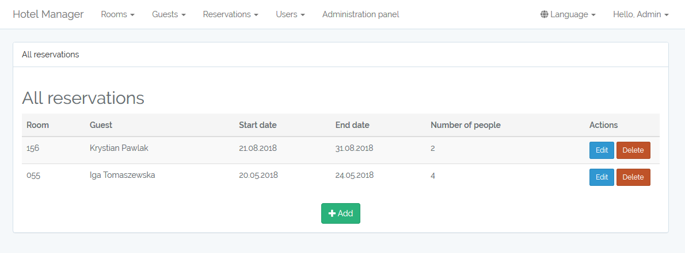

# Hotel Manager

[](https://travis-ci.org/Saibamen/HotelManager)
[](https://circleci.com/gh/Saibamen/HotelManager)
[](https://app.codeship.com/projects/256229)
[](https://scrutinizer-ci.com/g/Saibamen/HotelManager/)
[](https://codeclimate.com/github/Saibamen/HotelManager/maintainability)
[](https://styleci.io/repos/77186372)
[](https://insight.symfony.com/projects/37d84994-c778-4373-94f2-a3218c22f96d)
[](https://codecov.io/gh/Saibamen/HotelManager)

Web application for managing hotel rooms, guests and reservations with flexible and responsive frontend written in [Laravel](https://laravel.com) 5.6



## Requirements

* [PHP](http://php.net) >= 7.1.3
* OpenSSL PHP Extension
* PDO PHP Extension
* Mbstring PHP Extension
* Tokenizer PHP Extension
* XML PHP Extension
* [Composer](https://getcomposer.org)

## Installation

First, change `.env.example` to `.env` and update it

```
composer install --no-interaction
php artisan key:generate
php artisan migrate
php artisan db:seed
```

Run by `php artisan serve`
